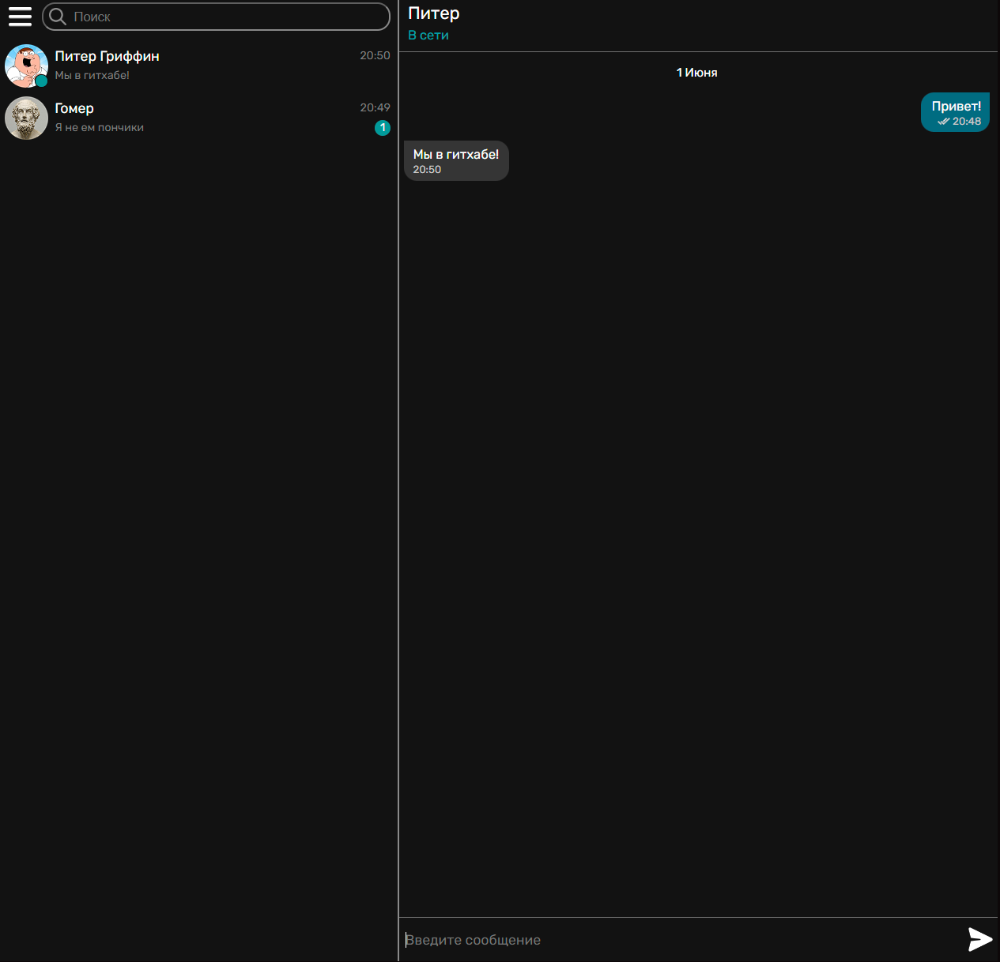
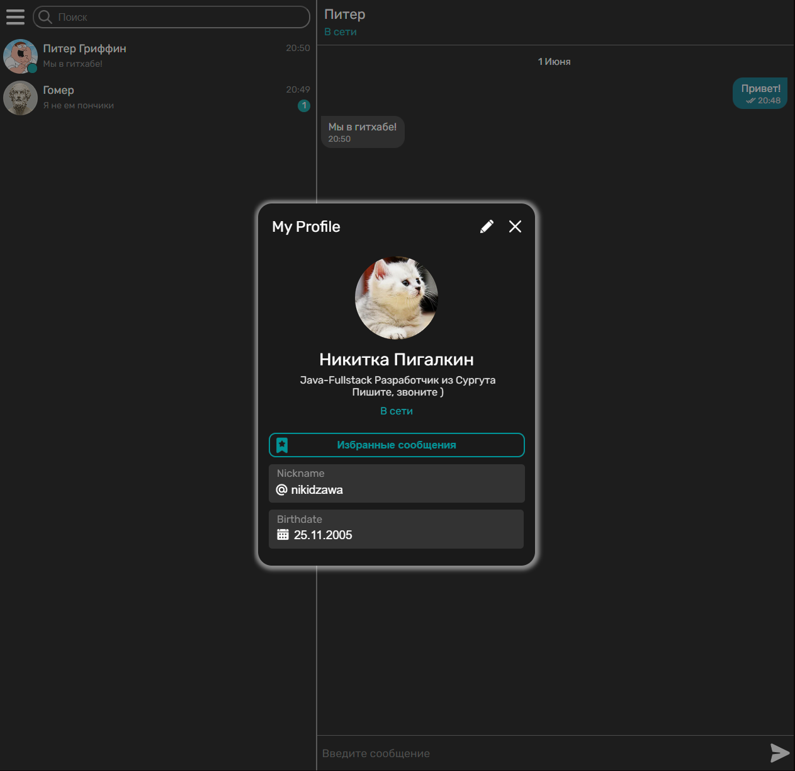
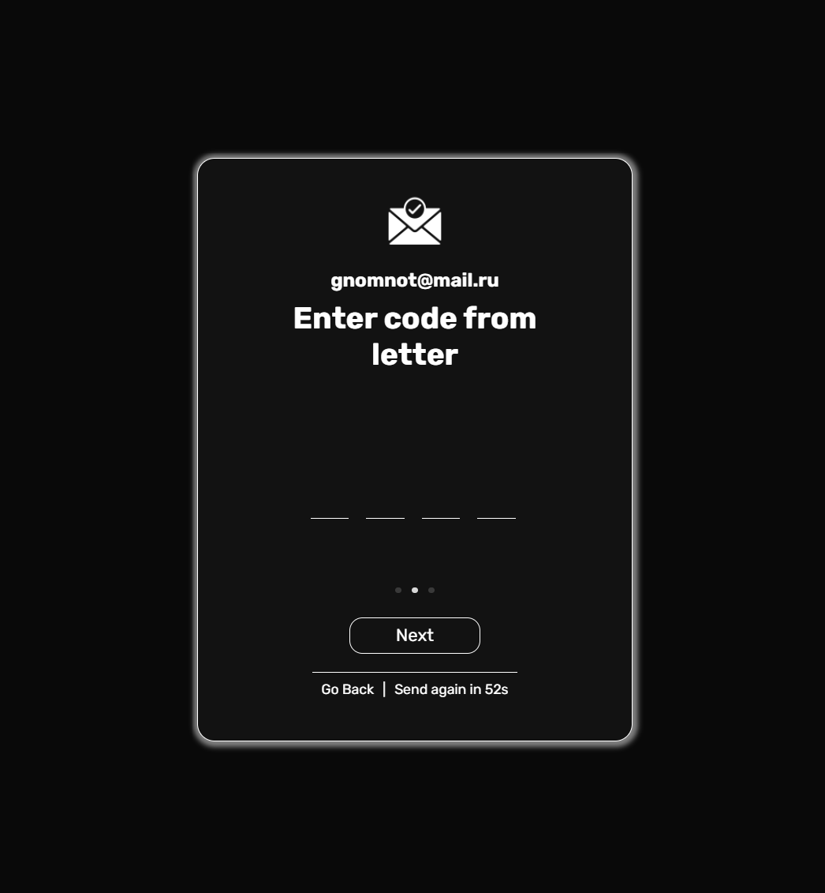

# Мессенджер Enigma (в разработке)

Десктопный кросс-платформенный мессенджер

## Что пока реализовано
* Обмен данными в режиме реального времени: 
  * Отправка, редактирование и удаление сообщений
  * Статус "Печатает"
  * Статус: "В сети"
  * Изменение профиля
  * Чтение сообщений
* Умная логика работы чата 
  * Динамическая загрузка старых сообщений при прокрутке вверх
  * Пометка даты сообщений, если она отличается между сообщениями
  * Пометка новых сообщений
* Профиль
  * Просмотр и изменение своего профиля
  * Просмотр профилей других пользователей
  * Возможность поставить аватар, а так же небольшой фоторедактор
  * Верификация по почте
* Поиск пользователей
* Защита на базе JWT токенов

## Медиа

### Главная страница со списком контактов

### Профиль

### Один из этапов регистрации - подтверждение почты

## Стек:
**Бекенд**: Java + Spring
 
**Фронтенд**: React + MobX

**Десктоп**: Electron
 
