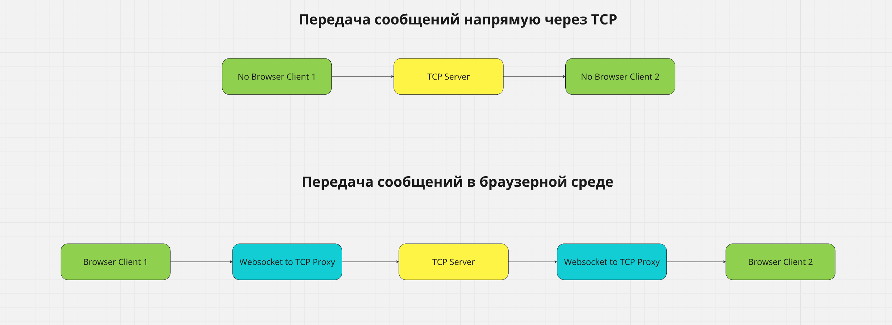

## Мессенджер Enigma

Удобный мессенджер для обмена сообщениями. 

### Сервер

Обмен данными между пользователями осуществляется в режиме реального времени на базе TCP протокола.

Для реализации сервера выбор пал на пакет java.nio, поскольку он обеспечивает лучшую производительность в условиях высоких нагрузок.

Для того чтобы мессенджером можно было пользоваться в браузерной среде, я создал прокси-сервер для обработки вебсокетов. 
Сама прослойка не влияет на производительность

Примерно так осуществляется обмен сообщениями (см. схему)

